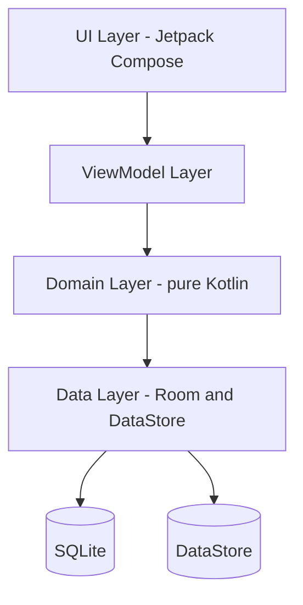

# Architecture - Layer Overview

High-level view of the four layers. Dependencies point inward only.

## Rules

- UI knows about ViewModels only
- ViewModels know about use cases only
- Use cases know about repository interfaces only
- Repository implementations are the only place allowed to touch both domain models and storage
- Domain layer has zero imports from Android, Room, or Hilt
