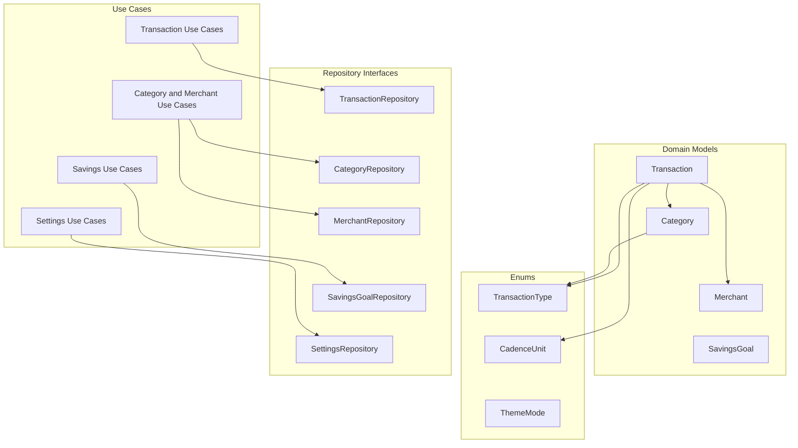

# Architecture - Domain Layer

Pure Kotlin. No Android, Room, or Hilt imports anywhere in this layer.

## Notes

- Each `Category` belongs to one `TransactionType`, so expense, income and savings each have their own category list.
- `ThemeMode` (System, Light, Dark) is the user's appearance choice, stored through `SettingsRepository` alongside the pay-cycle start day.
- Tags are free-form strings normalised by `normalizeTag` (lowercase, no spaces; inner spaces become hyphens).
- Savings is a `TransactionType`, not a separate model. The savings goal itself (`SavingsGoal`) holds only a target and a starting amount; the current total is derived from SAVING transactions.
