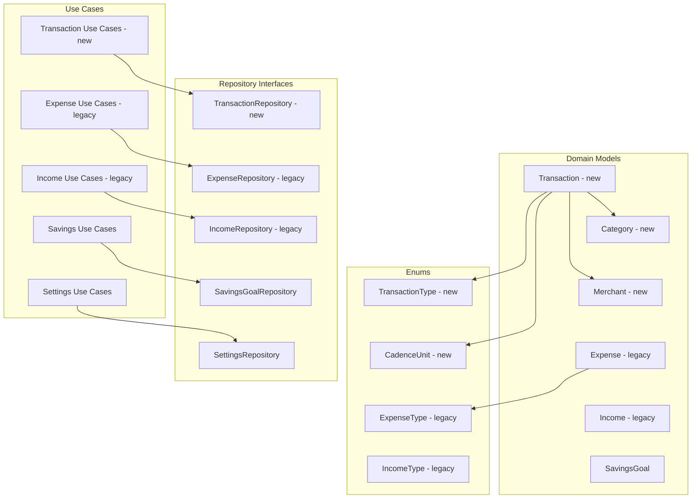

# Architecture - Domain Layer

Pure Kotlin. No Android, Room, or Hilt imports anywhere in this layer.

## Legend

- new: Part of the new unified Transaction model
- legacy: To be deleted after migration is complete
