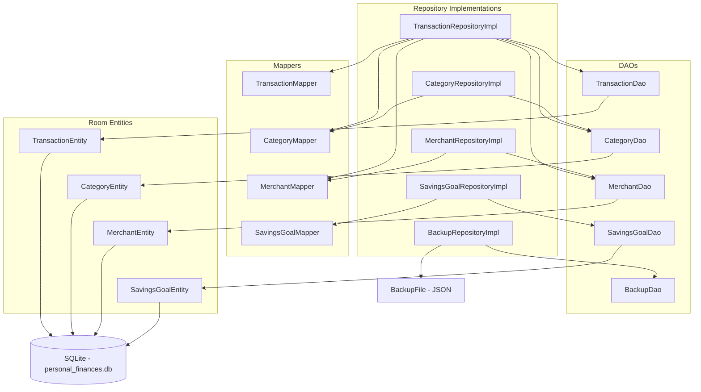

# Architecture - Data Layer

Handles all storage. Repository implementations are the only place that touch both domain models and Room entities simultaneously.

## Mapper conversions

| Entity field | Entity type | Domain field | Domain type |
|---|---|---|---|
| date | LocalDate (Room TypeConverter stores as Long) | date | LocalDate - no manual conversion |
| transactionType | String | transactionType | TransactionType enum |
| cadenceUnit | String | cadenceUnit | CadenceUnit enum |
| category transactionType | String | Category.type | TransactionType enum |
| tags | String JSON | tags | Set of String |
| categoryId | String FK | category | Category object - resolved in repo |
| merchantId | String FK nullable | merchant | Merchant object nullable - resolved in repo |

## Notes

- `Converters` is a concrete class registered with `@TypeConverters` on `AppDatabase`. It cannot be `AppDatabase` itself because Room instantiates the converter class and `AppDatabase` is abstract.
- There is no destructive-migration fallback. Version 9 is the baseline; later schema changes need migrations and a `MigrationTest`.
- `BackupDao` does bulk reads and `@Upsert` writes for backup and restore only. Backups use their own JSON shapes (`BackupFile`), separate from the Room entities, so the database can change without breaking old backups.
