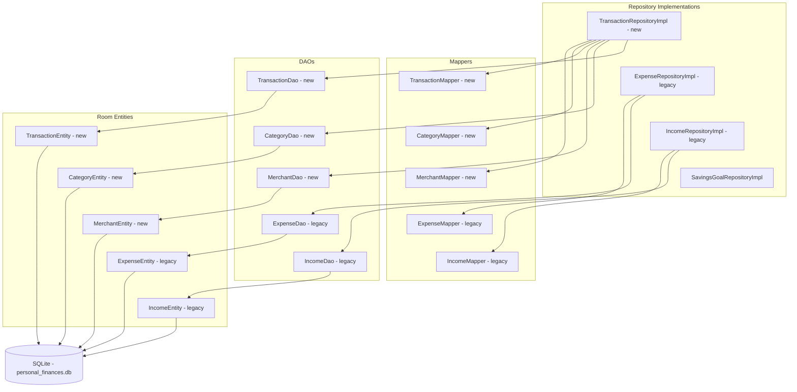

# Architecture - Data Layer

Handles all storage. Repository implementations are the only place that touch both domain models and Room entities simultaneously.

## Mapper conversions

| Entity field | Entity type | Domain field | Domain type |
|---|---|---|---|
| date | Long | date | LocalDate |
| transactionType | String | transactionType | TransactionType enum |
| cadenceUnit | String | cadenceUnit | CadenceUnit enum |
| tags | String JSON | tags | Set of String |
| categoryId | String FK | category | Category object - resolved in repo |
| merchantId | String FK nullable | merchant | Merchant object nullable - resolved in repo |
