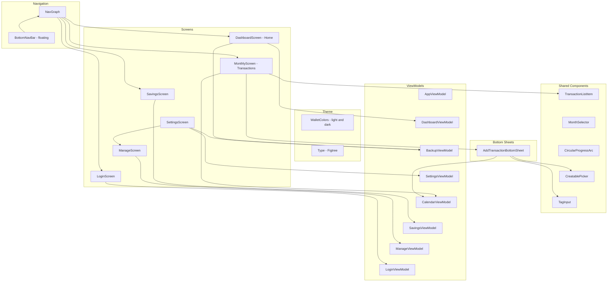

# Architecture - UI Layer

Jetpack Compose screens and components. Screens observe StateFlow from ViewModels and emit events back.

## Notes

- `MonthlyScreen.kt` contains `CalendarScreen` (shown as the Transactions tab), and its ViewModel is `CalendarViewModel` (in `MonthlyViewModel.kt`).
- One layout, two palettes: `MainActivity` reads the saved theme mode through `AppViewModel` and passes `darkTheme` to `PersonalFinancesTheme`. All colours come from `MaterialTheme.wallet`.
- The + button at the top right of the Transactions screen opens `AddTransactionBottomSheet`. The bottom bar has just the three tabs.
- `AddTransactionBottomSheet` is keypad-first: type control, amount with the keypad directly beneath it, category chips, and detail chips that open inline editors (merchant with `CreatablePicker`, tags with `TagInput`, repeat).
- Home also shows a backup reminder card when there is data and no recent backup. Transactions shows an Undo snackbar after a delete. `ManageScreen` (opened from Settings) renames and deletes categories and merchants.
- `SettingsScreen` (gear on Home) is grouped cards: General (currency, pay cycle day), Appearance (System, Light, Dark), Data (categories and merchants, export, import) and Account (log out). Small choices open in dialogs and save immediately. Money is formatted through `LocalMoneyFormatter`, provided in `MainActivity` from the saved currency.
