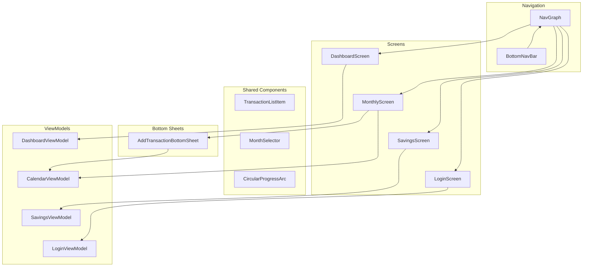

# Architecture - UI Layer

Jetpack Compose screens and components. Screens observe StateFlow from ViewModels and emit events back.

## Notes

- `MonthlyScreen.kt` contains `CalendarScreen`, and its ViewModel is `CalendarViewModel` (in `MonthlyViewModel.kt`).
- `AddTransactionBottomSheet` handles all three transaction types. It does not yet expose merchant or tag inputs (see backlog).
