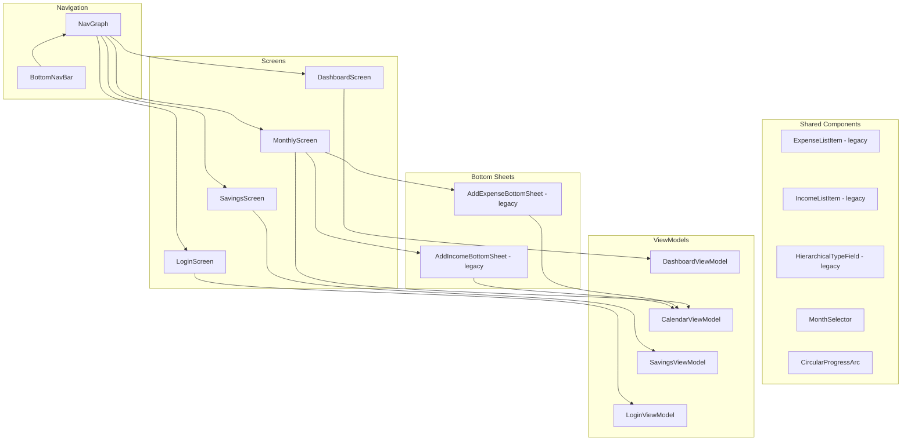

# Architecture - UI Layer

Jetpack Compose screens and components. Screens observe StateFlow from ViewModels and emit events back.

## Planned UI changes for the refactor

| Current | Replacement |
|---|---|
| HierarchicalTypeField | Single category picker with inline create |
| AddExpenseBottomSheet and AddIncomeBottomSheet | Unified AddTransactionBottomSheet |
| ExpenseListItem and IncomeListItem | Unified TransactionListItem |
