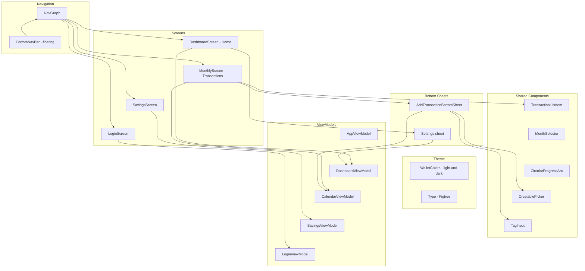

# Architecture - UI Layer

Jetpack Compose screens and components. Screens observe StateFlow from ViewModels and emit events back.

## Notes

- `MonthlyScreen.kt` contains `CalendarScreen` (shown as the Transactions tab), and its ViewModel is `CalendarViewModel` (in `MonthlyViewModel.kt`).
- One layout, two palettes: `MainActivity` reads the saved theme mode through `AppViewModel` and passes `darkTheme` to `PersonalFinancesTheme`. All colours come from `MaterialTheme.wallet`.
- The + button at the top right of the Transactions screen opens `AddTransactionBottomSheet`. The bottom bar has just the three tabs.
- `AddTransactionBottomSheet` is keypad-first: type control, amount with the keypad directly beneath it, category chips, and detail chips that open inline editors (merchant with `CreatablePicker`, tags with `TagInput`, repeat).
- The Settings sheet on Home holds the appearance choice (System, Light, Dark), the pay-cycle start day and Log out, which navigates back to the login screen.
